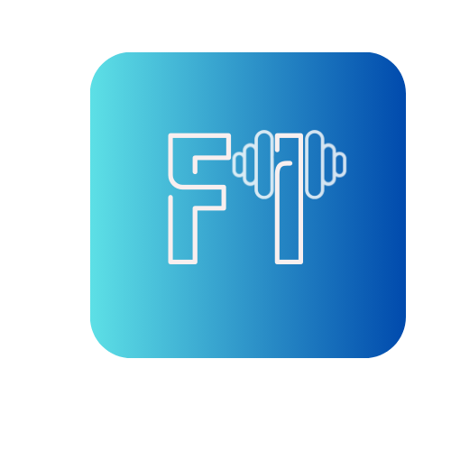

# 🏋️♀️ Fitto - Tu Compañero de Fitness Inteligente

  

  

**Fitto** es una aplicación revolucionaria que combina planes de ejercicio personalizados con seguimiento nutricional inteligente para ayudarte a alcanzar tus metas fitness de manera integral.

## ✨ Características Principales

### 🏋️ Entrenamiento Personalizado
- Rutinas adaptadas a tus objetivos (perder peso, ganar masa muscular, etc.)
- Ejercicios con videos demostrativos y guías paso a paso
- Planificador de entrenamientos semanal
- Seguimiento de progreso con métricas detalladas

### 🥗 Nutrición Inteligente
- Generador de planes alimenticios según tus requerimientos
- Base de datos de alimentos con información nutricional
- Escáner de códigos de barras para productos
- Registro de comidas con sistema de reconocimiento de imágenes

### 📊 Seguimiento Integral
- Dashboard personalizado con tu progreso
- Recordatorios inteligentes para entrenamientos y comidas
- Sistema de logros y recompensas
- Integración con wearables y apps de salud

## 🚀 Próximas Funcionalidades
- [ ] Comunidad Fitto (social fitness)
- [ ] Retos grupales y competencias amistosas
- [ ] Integración con asistentes virtuales
- [ ] Modo entrenador virtual con IA

## 🛠 Tecnologías Utilizadas
- **Herramientas:** Figma (diseño), Trello (gestión de proyecto), GitHub Actions (CI/CD)
